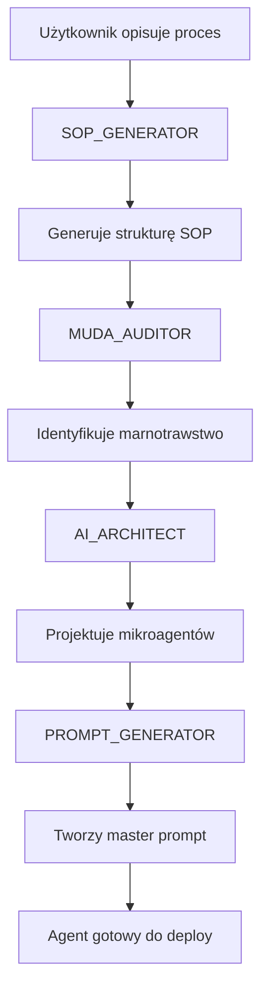

# SOP-AI Technical Documentation

## Dla Tech Leada — Pełny przegląd aplikacji

---

## 1. Czym jest SOP-AI?

**SOP-AI** to platforma do automatyzacji procesów biznesowych. Główna idea:

```
SOP (procedura) → Analiza MUDA → Projekt agentów AI → Master Prompt → Działający agent
```

Aplikacja pozwala firmom **przekształcić papierowe procedury w inteligentnych asystentów AI**.

---

## 2. Tech Stack

| Warstwa | Technologia |
|---------|-------------|
| Frontend | Next.js 15 (App Router) |
| UI Components | shadcn/ui + Radix UI |
| Styling | Tailwind CSS |
| Language | TypeScript |
| State | React hooks (useState, useEffect) |
| Storage | LocalStorage (via custom `db.ts`) |
| Theming | next-themes (dark/light mode) |

**Struktura katalogów:**
```
src/
├── app/                    # Pages (App Router)
│   ├── page.tsx           # Dashboard
│   ├── sops/              # SOP management
│   ├── agents/            # AI Agents registry
│   ├── muda/              # MUDA waste reports
│   ├── roles/             # Organizational roles
│   ├── council/           # Decision requests
│   ├── value-chain/       # Process value chain
│   └── pipeline/          # 5-step SOP-to-AI wizard
├── components/
│   ├── ui/                # shadcn components
│   ├── layout/            # Sidebar, navigation
│   └── pipeline/          # Pipeline-specific components
└── lib/
    ├── types.ts           # Core TypeScript interfaces
    ├── extended-types.ts  # Extended domain types
    ├── db.ts              # LocalStorage database wrapper
    ├── agent-prompts.ts   # AI system prompts
    └── prompts.ts         # Additional prompts
```

---

## 3. Data Model (Typy TypeScript)

### 3.1 Podstawowe encje

#### SOP (Standard Operating Procedure)
```typescript
interface SOP {
  id: string;
  meta: {
    process_name: string;
    department: string;
    role: string;
    owner: string;
    version: string;
  };
  purpose: string;
  scope: { trigger: string; outcome: string };
  steps: SOPStep[];
  metrics: {
    frequency_per_day: number;
    avg_time_min: number;
    people_count: number;
  };
  status: 'draft' | 'generated' | 'audited' | 'architected' | 'prompt-generated' | 'completed';
}
```

#### MudaReport (Analiza marnotrawstwa)
```typescript
// MUDA = 7 typów marnotrawstwa (Lean Manufacturing)
type MudaType = 
  | 'Transport'      // Zbędne przemieszczanie
  | 'Inventory'      // Nadmiar zapasów
  | 'Motion'         // Zbędny ruch
  | 'Waiting'        // Oczekiwanie
  | 'Overproduction' // Nadprodukcja
  | 'Overprocessing' // Nadmierne przetwarzanie
  | 'Defects';       // Wady/błędy

interface MudaReport {
  id: string;
  sop_id: string;
  waste_identified: WasteItem[];
  summary: {
    total_muda_count: number;
    total_potential_saving_min: number;
    automation_score: string;
  };
}
```

#### AgentSpec (Specyfikacja agenta AI)
```typescript
interface AgentSpec {
  id: string;
  sop_id: string;
  agents: MicroAgent[];          // Lista mikroagentów
  flow_mermaid: string;          // Diagram przepływu
  requirements_for_generator: {
    templates: string[];
    access_needed: string[];
    knowledge_base: string[];
  };
}

interface MicroAgent {
  name: string;
  responsibility: string;
  input_schema: AgentInputOutputSchema;
  output_schema: AgentInputOutputSchema;
  integrations: string[];        // np. ['Coda', 'Gmail']
  escalation_triggers: string[]; // Kiedy eskalować do człowieka
  guardrails: {
    banned_actions: string[];
    max_retries: number;
    timeout_sec: number;
  };
}
```

### 3.2 Rozszerzone typy (extended-types.ts)

| Typ | Opis | Zastosowanie |
|-----|------|--------------|
| `BPMNDiagram` | Mapa procesu (swimlanes, gateways) | Wizualizacja procesu |
| `ValueChainMap` | Łańcuch wartości Portera | Analiza wartości dodanej |
| `OrganizationalRole` | Rola w organizacji | Rejestr ról, RACI |
| `CouncilRequest` | Prośba o decyzję | Głosowanie nad zmianami |
| `Syllabus` | Słownik korporacyjny | Jednolita terminologia |
| `RegisteredAgent` | Zarejestrowany agent AI | Inwentarz agentów |
| `DigitalTwin` | Cyfrowy bliźniak firmy | Aggregacja wszystkiego |

---

## 4. Strony aplikacji (Routes)

### 4.1 Dashboard (`/`)
**Cel:** Główny widok z podsumowaniem i nawigacją.

**Komponenty:**
- Hero section z gradient background
- Stat Cards (SOPs, Agents, MUDA, Savings)
- Database Cards (linki do 6 baz danych)
- Recent Activity table

**Dane:** Pobiera z `sopDb`, `agentDb`, `mudaDb` (LocalStorage).

---

### 4.2 SOPs Database (`/sops`)
**Cel:** Lista wszystkich procedur z filtrowaniem.

**Funkcjonalności:**
- Wyszukiwanie po nazwie
- Filtr statusu (draft, generated, completed...)
- Filtr departamentu
- Count records
- Link do `/sops/new` (tworzenie)

---

### 4.3 Create SOP (`/sops/new`)
**Cel:** 5-krokowy wizard do tworzenia SOP i przekształcania w agenta AI.

**Pipeline (5 kroków):**

| Step | Nazwa | Opis |
|------|-------|------|
| 1 | SOP Generator | Użytkownik wprowadza opis procesu, AI generuje strukturę SOP |
| 2 | MUDA Audit | Analiza marnotrawstwa (7 typów), propozycje optymalizacji |
| 3 | AI Architect | Podział na mikroagentów, definiowanie input/output |
| 4 | Prompt Generator | Tworzenie master promptów dla każdego agenta |
| 5 | Review | Przegląd i zatwierdzenie całości |

**Stan przepływu:**
```typescript
// Każdy step może modyfikować:
currentSOP: SOP;
mudaReport: MudaReport;
agentSpec: AgentSpec;
masterPrompts: MasterPrompt[];
```

---

### 4.4 AI Agents (`/agents`)
**Cel:** Rejestr wszystkich agentów AI utworzonych z procedur.

**Wyświetla:**
- Nazwę agenta
- Typ (orchestrator, processor, analyzer...)
- Status (draft, testing, production)
- Powiązane SOP
- Integracje (Coda, Gmail, Fireflies...)

---

### 4.5 MUDA Reports (`/muda`)
**Cel:** Raporty z audytów marnotrawstwa.

**Zawiera:**
- Liczbę waste items
- Potential savings (minuty/godziny)
- Automation score
- Szczegóły każdego typu marnotrawstwa

---

### 4.6 Roles Registry (`/roles`)
**Cel:** Rejestr ról w organizacji.

**Funkcjonalności:**
- Lista departamentów + manager
- Role w każdym departamencie
- Typ: Human / AI / Hybrid
- Liczba przypisanych SOP
- Link do szczegółów

---

### 4.7 Value Chain (`/value-chain`)
**Cel:** Wizualizacja łańcucha wartości (Porter's Value Chain).

**Etapy:**
- Lead Generation
- Operations
- Service Delivery
- Support

**Metryki:**
- Czas dodawania wartości (VA time)
- Czas oczekiwania (Wait time)
- VA Ratio (stosunek wartości)
- Bottleneck level

---

### 4.8 Council Requests (`/council`)
**Cel:** System głosowania nad zmianami w organizacji.

**Typy requestów:**
- `budget` - Decyzje budżetowe
- `process_change` - Zmiany w procesach
- `ai_deploy` - Wdrożenie agenta AI
- `data_migration` - Migracja danych
- `role_change` - Zmiany w rolach

**Statusy:**
- `draft` → `voting` → `approved`/`rejected`/`expired`

---

## 5. System AI Agentów

### 5.1 Prompt Architecture

Aplikacja zawiera 8 zdefiniowanych agentów AI w `agent-prompts.ts`:

| Agent | Rola | Token Budget |
|-------|------|--------------|
| `ORCHESTRATOR` | Koordynator główny | ~2000 |
| `SOP_GENERATOR` | Tworzenie procedur | ~4000 |
| `MUDA_AUDITOR` | Analiza marnotrawstwa | ~3000 |
| `AI_ARCHITECT` | Projektowanie mikroagentów | ~4000 |
| `PROMPT_GENERATOR` | Generowanie promptów | ~3000 |
| `BPMN_MAPPER` | Mapy procesów | ~4000 |
| `VALUE_CHAIN_ANALYST` | Łańcuch wartości | ~3000 |
| `ROLE_MAPPER` | Mapowanie ról (RACI) | ~3000 |

### 5.2 Prompt Format

Wszystkie prompty używają formatu XML:
```xml
<system>Definicja roli agenta</system>
<objective>Cel główny</objective>
<context>Dane wejściowe</context>
<output_schema>JSON schema outputu</output_schema>
<guardrails>Ograniczenia bezpieczeństwa</guardrails>
```

---

## 6. Database Layer (db.ts)

### 6.1 Storage Pattern
```typescript
class LocalStorageDB<T> {
  constructor(private key: string) {}
  
  getAll(): T[] { /* LocalStorage.getItem */ }
  getById(id: string): T | undefined { /* find by id */ }
  create(item: T): void { /* push + save */ }
  update(id: string, item: T): void { /* replace + save */ }
  delete(id: string): void { /* filter + save */ }
}
```

### 6.2 Dostępne bazy
```typescript
export const sopDb = new LocalStorageDB<SOP>('sop-ai-sops');
export const mudaDb = new LocalStorageDB<MudaReport>('sop-ai-muda');
export const agentDb = new LocalStorageDB<AgentSpec>('sop-ai-agents');
```

> **Uwaga:** To rozwiązanie na potrzeby MVP/demo. Produkcyjnie dane będą w Coda API.

---

## 7. UI Components (shadcn/ui)

### 7.1 Używane komponenty
| Komponent | Zastosowanie |
|-----------|--------------|
| `Button` | Akcje, CTA |
| `Input` | Formularze, wyszukiwanie |
| `Badge` | Statusy, tagi |
| `Card` | Kontener treści |
| `Select` | Dropdowny, filtry |
| `Dialog` | Modale |
| `Tabs` | Nawigacja w widokach |
| `Progress` | Wskaźnik postępu |

### 7.2 Theming

**Provider:** `next-themes`
```tsx
<ThemeProvider attribute="class" defaultTheme="light">
  {children}
</ThemeProvider>
```

**CSS Variables (`globals.css`):**
```css
:root {
  --background: #fafafa;
  --foreground: #18181b;
  --card: #ffffff;
  --border: #e5e5e5;
  --muted-foreground: #71717a;
}

.dark {
  --background: #0a0a0f;
  --foreground: #ffffff;
  --card: #18181b;
  --border: #27272a;
  --muted-foreground: #a1a1aa;
}
```

---

## 8. Integracje (Planowane/MCP)

```typescript
const SUPPORTED_INTEGRATIONS = [
  'Coda',              // Baza danych
  'Google Workspace',  // Gmail, Calendar, Drive
  'Fireflies',         // Transkrypcje spotkań
  'Railway',           // Deployment
  'Komodo',            // ?
  'SendGrid',          // Email
  'Stripe'             // Płatności
] as const;
```

---

## 9. Kluczowe Flow (Przykład)

### Tworzenie agenta AI z procedury:



---

## 10. Uruchomienie lokalne

```bash
cd src/sop-ai-app

# Install dependencies
npm install

# Development server
npm run dev

# Production build
npm run build
npm start
```

**URL:** http://localhost:3000

---

## 11. Plany rozwoju

1. **Backend API** - Migracja z LocalStorage do Coda API
2. **AI Integration** - Połączenie z Claude/GPT via API
3. **Real-time sync** - WebSocket dla multi-user
4. **BPMN Viewer** - Interaktywne mapy procesów
5. **Agent Playground** - Testowanie promptów na żywo

---

## Kontakt

Pytania techniczne: Marcin Kapusta
Repository: `/Users/marcinkapusta/Documents/SYHI/Vantage-OS/src/sop-ai-app`
